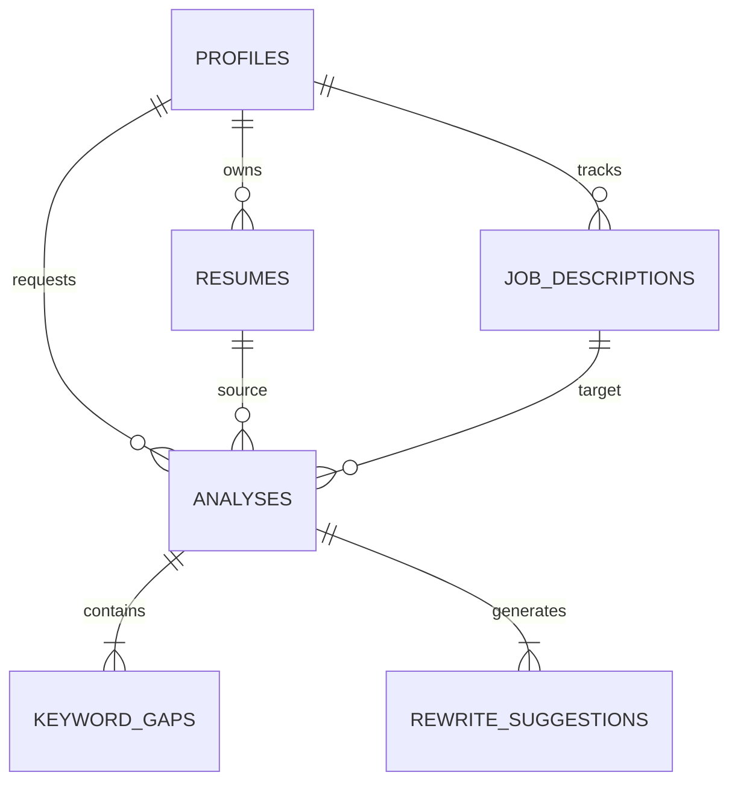

# Nexus Career AI - Database Schema

## Overview

This schema is designed for a multi-tenant SaaS application running on PostgreSQL (Supabase). It strictly follows normalization principles, uses UUIDs for primary keys, and enforces Row Level Security (RLS) to ensure data isolation between users.

## Tables

### 1. `profiles`
**Purpose:** Extends the default Supabase `auth.users` table with application-specific user data.
*   **`id`** (UUID, PK): References `auth.users.id` (One-to-One).
*   **`full_name`** (Text): User's display name.
*   **`linkedin_url`** (Text, Nullable): Link to LinkedIn profile.
*   **`portfolio_url`** (Text, Nullable): Link to portfolio.
*   **`target_role`** (Text, Nullable): E.g., "Senior Software Engineer".
*   **`created_at`** (Timestamptz): Default `now()`.
*   **`updated_at`** (Timestamptz): Default `now()`.

### 2. `resumes`
**Purpose:** Stores metadata and content of uploaded resumes.
*   **`id`** (UUID, PK): Default `gen_random_uuid()`.
*   **`user_id`** (UUID, FK): References `profiles.id`.
*   **`file_path`** (Text): Path to the file in Supabase Storage.
*   **`file_name`** (Text): Original filename (e.g., "John_Doe_CV.pdf").
*   **`parsed_content`** (JSONB): Structured data extracted from the resume (skills, experience, education).
*   **`raw_text`** (Text): Full text content for full-text search.
*   **`created_at`** (Timestamptz).
*   **`updated_at`** (Timestamptz).

### 3. `job_descriptions`
**Purpose:** Stores job postings that the user wants to target.
*   **`id`** (UUID, PK).
*   **`user_id`** (UUID, FK): References `profiles.id`.
*   **`title`** (Text): Job title.
*   **`company`** (Text): Company name.
*   **`url`** (Text, Nullable): Link to the job post.
*   **`raw_text`** (Text): Full text of the job description.
*   **`status`** (Enum): 'saved', 'applied', 'interviewing', 'offer', 'rejected'.
*   **`created_at`** (Timestamptz).
*   **`updated_at`** (Timestamptz).

### 4. `analyses`
**Purpose:** Stores the AI analysis result comparing a specific resume to a specific job description.
*   **`id`** (UUID, PK).
*   **`user_id`** (UUID, FK): References `profiles.id`.
*   **`resume_id`** (UUID, FK): References `resumes.id`.
*   **`job_description_id`** (UUID, FK): References `job_descriptions.id`.
*   **`match_score`** (Integer): 0-100 score indicating fit.
*   **`summary`** (Text): High-level AI feedback.
*   **`created_at`** (Timestamptz).

### 5. `keyword_gaps`
**Purpose:** Identifies specific skills or keywords missing from the resume for a given analysis.
*   **`id`** (UUID, PK).
*   **`analysis_id`** (UUID, FK): References `analyses.id` (Cascade Delete).
*   **`keyword`** (Text): The missing term (e.g., "Kubernetes").
*   **`category`** (Text): E.g., "Hard Skill", "Soft Skill", "Certification".
*   **`importance`** (Enum): 'critical', 'high', 'medium', 'low'.
*   **`status`** (Enum): 'missing', 'partial', 'present'.

### 6. `rewrite_suggestions`
**Purpose:** specific actionable text improvements for resume sections.
*   **`id`** (UUID, PK).
*   **`analysis_id`** (UUID, FK): References `analyses.id` (Cascade Delete).
*   **`section`** (Text): E.g., "Experience", "Summary".
*   **`original_text`** (Text): The text segment being critiqued.
*   **`suggested_text`** (Text): The AI-improved version.
*   **`reasoning`** (Text): Why this change improves the resume.
*   **`created_at`** (Timestamptz).

## Relationships Diagram

